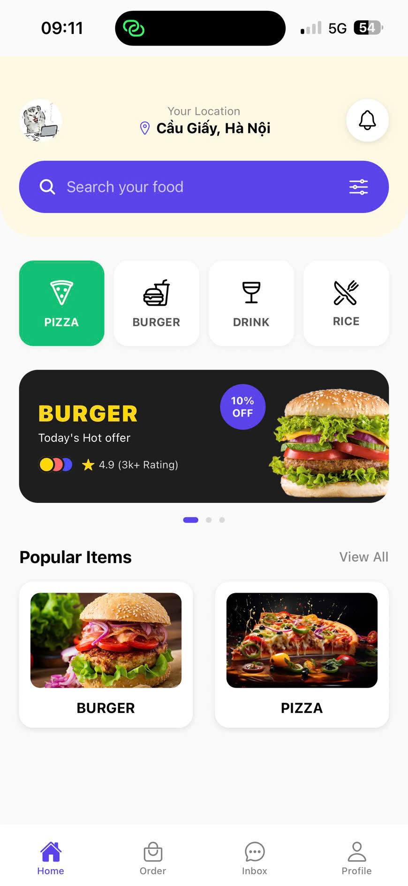
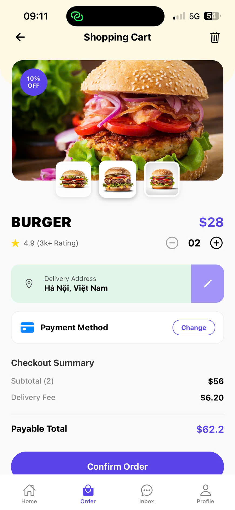
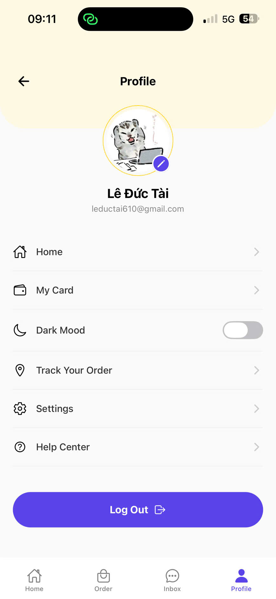

# Bài tập Thực hành 16/03/2026: Giao diện App Đặt Đồ Ăn (Restaurant UI)

## 📌 Thông tin sinh viên
* **Họ và tên:** Lê Đức Tài
* **Mã số sinh viên:** 23810310296
* **Lớp:** D18CNPM4
---

## 📱 Kết quả thực hiện (Screenshots)

Dự án hoàn thiện 3 màn hình chính sử dụng React Native, Expo và Bottom Tab Navigation để chuyển trang.

### 1. Màn hình Home (Trang chủ)

### 2. Màn hình Cart (Giỏ hàng / Order)

### 3. Màn hình Profile (Trang cá nhân)
