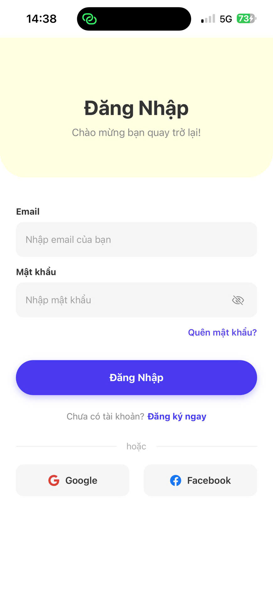

# Bài tập: Restaurant App - Phần 2 (Login & Tìm kiếm)

## 📌 Thông tin sinh viên
* **Họ và tên:** Lê Đức Tài
* **Mã số sinh viên:** 23810310296
* **Lớp:** D18CNPM4

---

## Tính năng mới cập nhật (Phần 2)
Dự án được nâng cấp từ Phần 1, bổ sung các chức năng xử lý logic và quản lý trạng thái:
1. **Đăng nhập & Đăng xuất (Context API):** Sử dụng `AuthContext` để quản lý trạng thái toàn cục. Luồng điều hướng tự động chặn người dùng ở màn hình Login nếu chưa đăng nhập, và đá văng ra ngoài khi bấm Log Out ở trang Profile.
2. **Tìm kiếm dữ liệu động:** Tính năng thanh tìm kiếm ở trang chủ, sử dụng JavaScript (`filter` & `includes`) để lọc món ăn trực tiếp khi người dùng gõ từ khóa.
3. **Quản lý dữ liệu Local:** Chuyển đổi dữ liệu tĩnh thành mảng JSON được lưu trữ trong file `data.js`, giúp dễ dàng gọi và đổ dữ liệu (render) ra màn hình bằng hàm `map()`.

---

## 📱 Kết quả thực hiện (Screenshots)

### 1. Màn hình Login (Giao diện mới)

### 2. Màn hình Home (Đổ dữ liệu & Tìm kiếm)

### 3. Màn hình Profile (Có chức năng Log Out)

